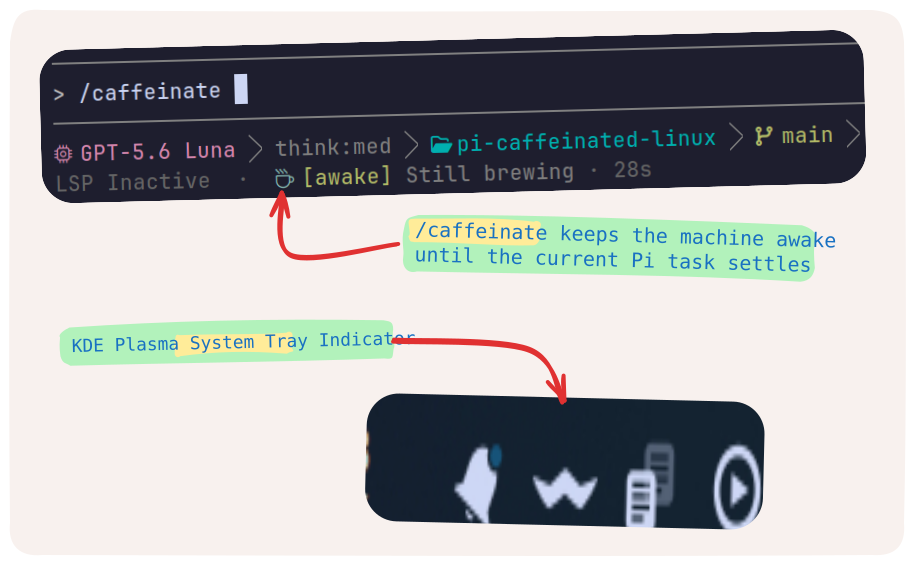

# pi-caffeinated-linux

A Linux-only Pi extension that keeps the machine awake with `systemd-inhibit`.



## Features

- `/caffeinate` keeps the machine awake until the current Pi task settles
- `/caffeinate manual` keeps it awake until you stop it yourself
- Colored live Pi footer status with a short random coffee quote, for example
  ` [awake] Still brewing · <elapsed>`
- Press `Esc` or run `/caffeinate` again to stop
- KDE Plasma tray indicator through the StatusNotifierItem D-Bus protocol
- Click the tray indicator or choose **Stop keeping awake** from its menu
- Cleans up the inhibitor and indicators when Pi shuts down

## Requirements

- Pi coding agent extension runtime
- Linux with `systemd-inhibit` available on `PATH`
- Node.js 22.12 or newer
- A D-Bus session bus for the optional KDE tray indicator

The extension uses this systemd command:

```text
systemd-inhibit --what=idle:sleep --who=pi-caffeinated \
  --why="Keeping the machine awake from Pi" --mode=block sleep infinity
```

The `idle` lock prevents automatic idle handling. The `sleep` lock prevents user-requested suspend and hibernation. The tray indicator is optional; the Pi status and systemd inhibitor continue to work when no StatusNotifier host is available.

## Install

```sh
pi install npm:@nimendra/pi-caffeinated-linux
```

Restart/Reload Pi after installing or updating the extension.

## Usage

Run the command inside Pi:

```text
/caffeinate          # automatic: stop when the Pi task settles
/caffeinate manual   # manual: stay active until stopped
```

`/caffeinate` is also accepted as `/caffeinate auto`. Automatic mode stops when Pi has finished the agent response, tool calls, retries, compaction, and queued follow-up work. Manual mode remains active until `Esc`, `/caffeinate`, the KDE tray indicator, or Pi shutdown stops it.

While active:

- Pi shows a colored status such as ` [awake] Still brewing · <elapsed>` in the
  footer. The quote is selected once when the session starts, so it does not
  flicker every second.
- KDE Plasma shows an active coffee indicator in the system tray when a
  StatusNotifier host is available.

Stop either mode with `Esc`, by running `/caffeinate` again, by clicking the
KDE tray indicator, or by choosing **Stop keeping awake** from its menu.

## Diagnostics

List active systemd inhibitors with:

```sh
systemd-inhibit --list
```

Look for an entry with `pi-caffeinated` and both `idle` and `sleep` (the order may appear as `sleep:idle`). If `systemd-inhibit` is not found, install the systemd package for your distribution. If the KDE tray indicator is unavailable, check that a user D-Bus session and a Plasma StatusNotifier host are running; the colored Pi footer status remains available without them.

### Troubleshooting

| Symptom                       | Check                                                                    | Action                                                                            |
| ----------------------------- | ------------------------------------------------------------------------ | --------------------------------------------------------------------------------- |
| Footer status does not start  | `command -v systemd-inhibit`                                             | Install systemd or use a systemd-based Linux session.                             |
| Inhibitor exits unexpectedly  | `systemd-inhibit --list`                                                 | Restart the command and check the reported exit reason.                           |
| Stop reports a signal failure | Process permissions and `systemd-inhibit --list`                         | End the stale process manually if required, then restart Pi.                      |
| Tray is unavailable           | `echo "$DBUS_SESSION_BUS_ADDRESS"`; check the Plasma StatusNotifier host | The footer and inhibitor still work; restore the user D-Bus session for the tray. |
| Tray registration fails       | `qdbus6 --session`                                                       | Check the KDE/freedesktop StatusNotifierWatcher and retry Pi.                     |

## License

MIT
